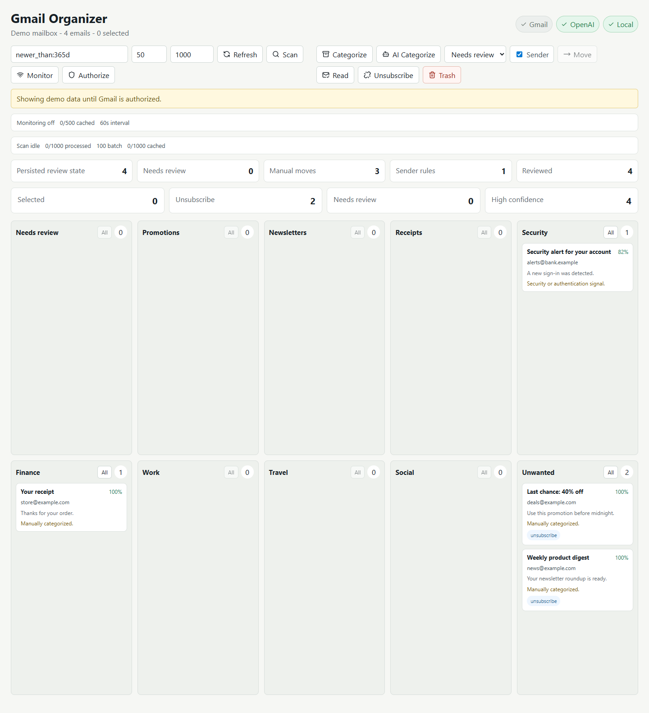

# Gmail Organizer

Local-first Gmail organizer for reviewing, categorizing, deleting, and preparing unsubscribe actions for high-volume inbox cleanup.

## Architecture

- Go backend for low memory overhead, secure local API boundaries, Gmail OAuth integration, and batched metadata-only email reads.
- React + Vite dashboard for category lanes, inbox review, AI categorization, and bulk actions.
- Secrets stay outside the repo. The app references `GOOGLE_CLIENT_SECRET_FILE` and `OPENAI_API_KEY_FILE` paths and never returns secret values from the API.

## Current Status

This is the initial working slice. It includes:

- Gmail OAuth URL and callback endpoints.
- Gmail metadata fetch using `gmail.modify` scope.
- Heuristic categorization and optional OpenAI Responses API categorization.
- Dashboard lanes by category.
- Per-lane stored totals and load controls for reviewing SQLite-backed category pages.
- Explicit AI toggle for scan/monitor jobs with bounded backend AI classification chunks.
- Manual category correction for selected emails.
- Sender rules from manual category corrections for future monitoring/scanning.
- SQLite-backed persisted review coverage metrics across scans and manual moves.
- Reload stored category pages from prior scans for later review and cleanup.
- Bulk trash, mark-read, and unsubscribe-preparation actions.
- Batched Gmail mark-read updates for high-volume cleanup selections.
- Two-step confirmation for destructive trash and one-click unsubscribe actions.
- One-click unsubscribe execution for Gmail messages that advertise `List-Unsubscribe-Post: List-Unsubscribe=One-Click`.
- Paged mailbox scanning for larger cleanup passes without loading the full mailbox into memory.
- Demo data fallback when Gmail is not authenticated.

## Setup

From the repo root:

```powershell
go mod tidy
cd web
npm install
npm run build
cd ..
go run ./cmd/server
```

Default secret discovery looks up parent directories for:

- `client_secret*.json`
- `openai_key.txt`

You can override paths without exposing values:

```powershell
$env:GOOGLE_CLIENT_SECRET_FILE="<absolute path to client_secret*.json>"
$env:OPENAI_API_KEY_FILE="<absolute path to openai_key.txt>"
```

Open `http://127.0.0.1:8787`.

If your Google OAuth client is registered with `http://localhost:8080/oauth2callback`, start the app with the matching local callback:

```powershell
$env:GMAIL_ORGANIZER_PORT="8080"
$env:GMAIL_ORGANIZER_OAUTH_REDIRECT_URL="http://localhost:8080/oauth2callback"
go run ./cmd/server
```

Then open `http://localhost:8080`. While the OAuth consent screen is in testing mode, add the Gmail account you are signing in with under the Google Cloud OAuth consent screen test users list.

Optional monitoring settings:

```powershell
$env:GMAIL_ORGANIZER_MONITOR_INTERVAL_SECONDS="60"
$env:GMAIL_ORGANIZER_MONITOR_CACHE_LIMIT="500"
$env:GMAIL_ORGANIZER_SCAN_CACHE_LIMIT="1000"
```

Optional OpenAI safety settings:

```powershell
$env:OPENAI_MAX_OUTPUT_TOKENS="2000"
$env:OPENAI_MAX_RETRIES="3"
$env:OPENAI_REQUEST_DELAY_MS="1200"
$env:OPENAI_CLASSIFY_CHUNK_SIZE="25"
$env:OPENAI_TIMEOUT_SECONDS="45"
```

## Screenshot



## Security Notes

- The backend binds to `127.0.0.1` by default.
- Mutating API requests with non-local browser origins are blocked.
- Email listing fetches metadata headers and snippets, not full message bodies.
- Bulk delete uses Gmail trash, not immediate permanent deletion.
- Trash and one-click unsubscribe actions return a preview first and require a short-lived server-issued confirmation token before execution.
- Unsubscribe actions execute only standards-based HTTPS one-click requests; ordinary HTTPS and `mailto:` unsubscribe targets are prepared as review links.
- API responses include secret file paths and existence status only, never secret contents.
- Background monitoring keeps a bounded in-memory cache and uses metadata/snippets rather than full message bodies.
- Mailbox scans fetch Gmail metadata in pages, persist classifications after each batch, and keep only a bounded recent cache in memory.
- Review coverage stats are derived from local classification state and do not require reloading message bodies.
- Stored category pages preserve minimal metadata needed for later review/actions without keeping the full scan in memory.
- Review state, sender rules, and action audit entries are stored in `data/review_state.db`; older JSON state files are imported into SQLite on first startup.
- Successfully trashed messages are removed from local review state after the action is audited.
- Sender rules are stored locally and apply to future emails after classifier output but before per-message overrides.
- AI scan/monitor classification is opt-in and chunked so prompts stay bounded.
- OpenAI classification uses configurable chunk size, output-token cap, request pacing, timeout, and retry settings for rate-limit-aware scanning.
- Mark-read actions use Gmail batch modify calls of up to 1000 message IDs per request.
- Action audit reads allow bounded large entries so 1000-message cleanup results remain reviewable.

## Verification

```powershell
go test ./...
cd web
npm run build
npm audit --json
```

The current dashboard screenshot was captured from a running local backend at `http://127.0.0.1:8787`.
