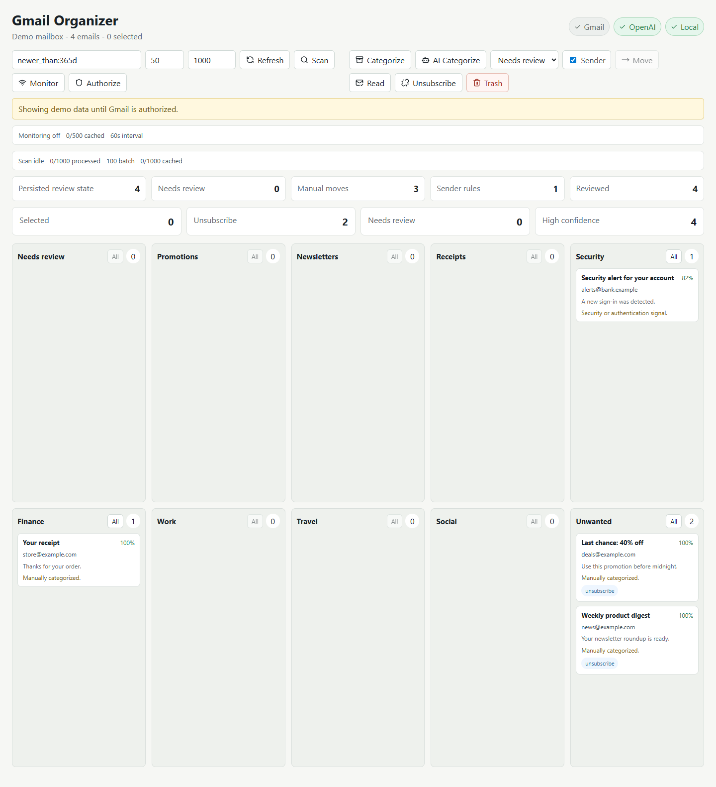
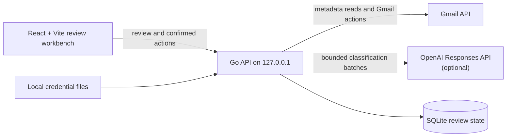
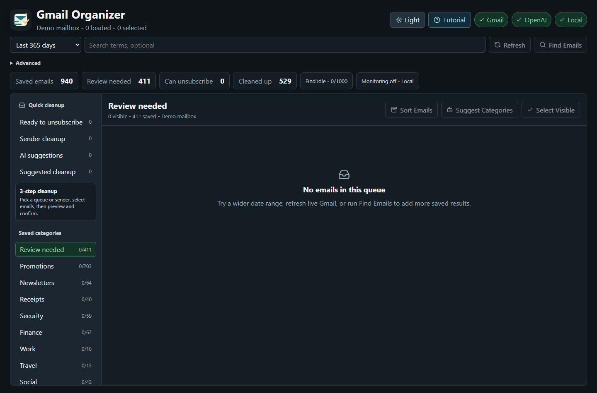
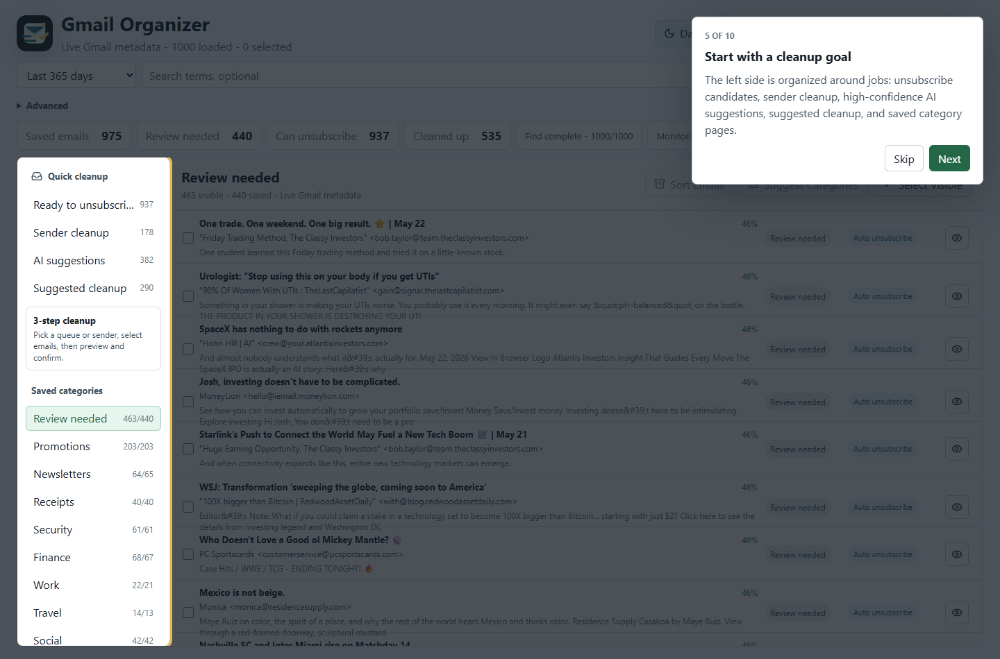
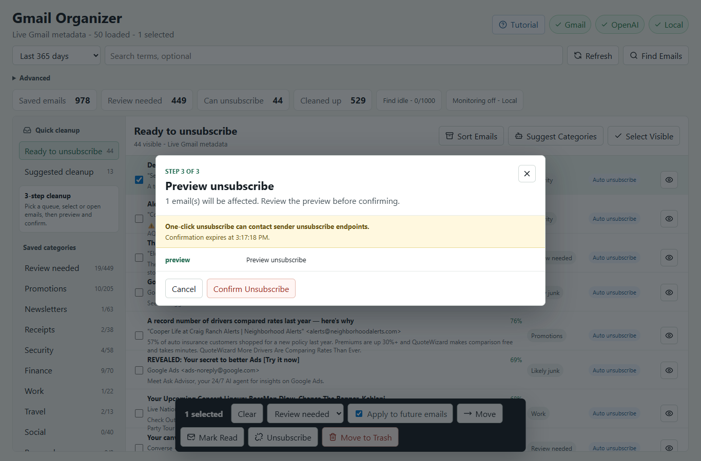
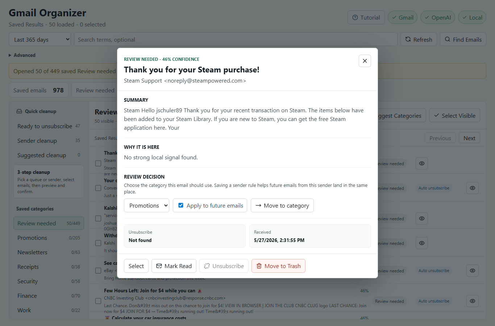
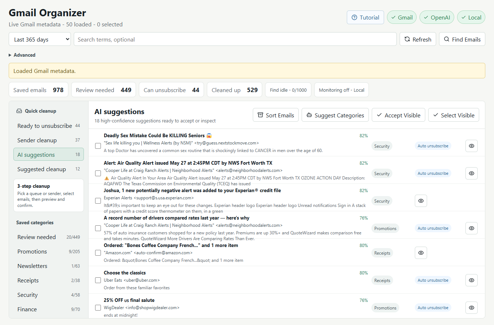

# Gmail Organizer

[](https://github.com/schulerj89/gmail-organizer/actions/workflows/ci.yml)
[](LICENSE)

**A local-first Gmail cleanup workbench with optional AI classification, human review, and reversible actions.**

Gmail Organizer helps people work through an overloaded inbox without handing destructive decisions to a model. It combines a Go backend, a React review interface, Gmail OAuth, SQLite-backed state, heuristic rules, and optional OpenAI Responses API classification.



## Why this project

Inbox cleanup is deceptively risky: a useful tool has to move quickly across thousands of messages while keeping private data bounded and every destructive action understandable.

Gmail Organizer is designed around four constraints:

- **Local first:** the API binds to loopback, secrets stay in local files, and review state stays in SQLite.
- **Human in the loop:** AI proposes categories; the user reviews, corrects, and decides what happens.
- **Reversible by default:** deletion moves messages to Gmail Trash instead of permanently deleting them.
- **Operationally bounded:** scans are paged, AI work is chunked, caches are capped, and risky actions require a short-lived confirmation token.

## Product highlights

- Review queues for categories, unsubscribe-ready messages, suggested cleanup, senders, and AI recommendations.
- Heuristic classification with optional OpenAI classification for selected scans and monitoring jobs.
- Manual corrections that create reusable sender rules for later cleanup passes.
- Metadata-only Gmail reads, paged scans, batched mark-read actions, and bounded in-memory caches.
- Preview-and-confirm flows for Trash and standards-based one-click unsubscribe actions.
- SQLite persistence for classifications, review coverage, sender rules, and action history.
- Demo data when Gmail is not authenticated, so the interface can be evaluated without connecting an inbox.
- Guided onboarding, light and dark themes, and responsive cleanup workflows.

## Architecture


```mermaid
flowchart LR
    UI["React + Vite review workbench"]
    API["Go API on 127.0.0.1"]
    Gmail["Gmail API"]
    AI["OpenAI Responses API<br/>(optional)"]
    DB[("SQLite review state")]
    Secrets["Local credential files"]

    UI -->|"review and confirmed actions"| API
    API -->|"metadata reads and Gmail actions"| Gmail
    API -.->|"bounded classification batches"| AI
    API --> DB
    Secrets --> API
```

The browser never receives credential values. The Go service owns OAuth, Gmail access, classification, persistence, confirmation tokens, and origin checks; the React client owns review and decision-making.

## Safety model

| Risk | Control |
| --- | --- |
| Accidental deletion | Messages go to Gmail Trash; the permanent-delete endpoint is not used |
| Unreviewed destructive actions | Trash and one-click unsubscribe use preview plus a short-lived, action-bound confirmation token |
| Cross-origin local API calls | Mutating requests from non-local origins are rejected |
| Secret exposure | API keys and OAuth credentials are loaded from files and never returned in API responses |
| Excessive model input or spend | AI is optional, classifications are chunked, and token, timeout, retry, and pacing limits are configurable |
| Unbounded mailbox state | Gmail reads are paged and local caches have explicit limits |

See [SECURITY.md](SECURITY.md) for vulnerability reporting and the current security scope.

## Run locally

### Requirements

- Go 1.25 or newer
- Node.js 24 or newer
- A Gmail OAuth client for real inbox access
- An OpenAI API key only if AI classification is enabled

Build the web app and start the local server:

```powershell
cd web
npm ci
npm run build
cd ..
go run ./cmd/server
```

Open <http://127.0.0.1:8787>. Without Gmail authorization, the workbench falls back to demo data.

Secrets stay outside source control. Point the app to local files when you are ready to connect services:

```powershell
$env:GOOGLE_CLIENT_SECRET_FILE="<absolute path to client_secret.json>"
$env:OPENAI_API_KEY_FILE="<absolute path to openai_key.txt>"
go run ./cmd/server
```

See [docs/SETUP.md](docs/SETUP.md) for Gmail OAuth configuration, alternate callback ports, monitoring limits, and OpenAI safety settings.

## Gmail permissions

The app requests the Gmail `gmail.modify` scope because it reads message metadata, marks selected messages as read, and moves selected messages to Trash. It does **not** use Gmail's permanent-delete endpoint.

Google describes `gmail.modify` as read/write Gmail access except immediate permanent deletion that bypasses Trash. See the [Gmail API scope reference](https://developers.google.com/workspace/gmail/api/auth/scopes).

## Screenshots

<details>
<summary>View the product tour</summary>

### Dark mode



### Guided tutorial



### Cleanup preview



### Review decision



### AI suggestions



</details>

## Verification

Run the same core checks used by CI:

```powershell
go test ./...
go vet ./...

cd web
npm ci
npm test
npm run build
```

## Project status

Gmail Organizer is an active personal project at the `0.x` stage. The core cleanup and review loop works, but interfaces and storage details may still evolve before a stable `1.0` release.

See the [changelog](CHANGELOG.md) and [open issues](https://github.com/schulerj89/gmail-organizer/issues) for current work.

## Contributing

Bug reproductions, documentation improvements, tests, accessibility fixes, and focused feature proposals are welcome. Read [CONTRIBUTING.md](CONTRIBUTING.md) before opening a pull request.

## License

Gmail Organizer is available under the [MIT License](LICENSE).
